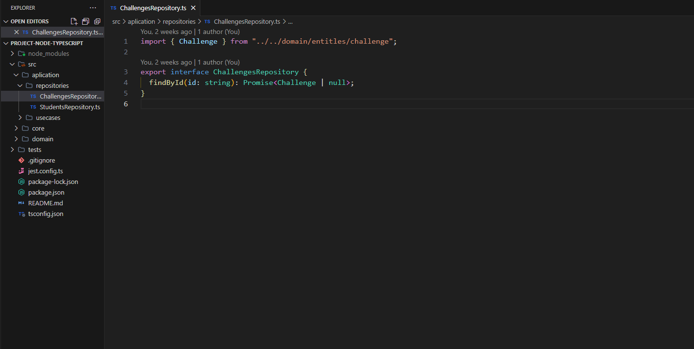
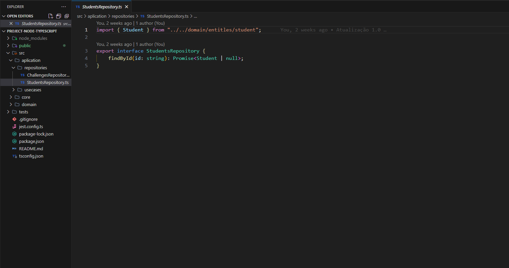
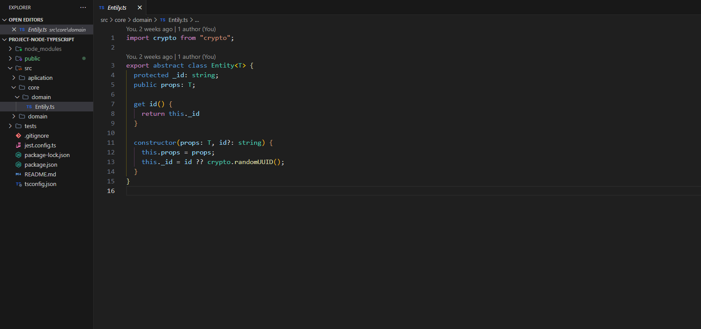
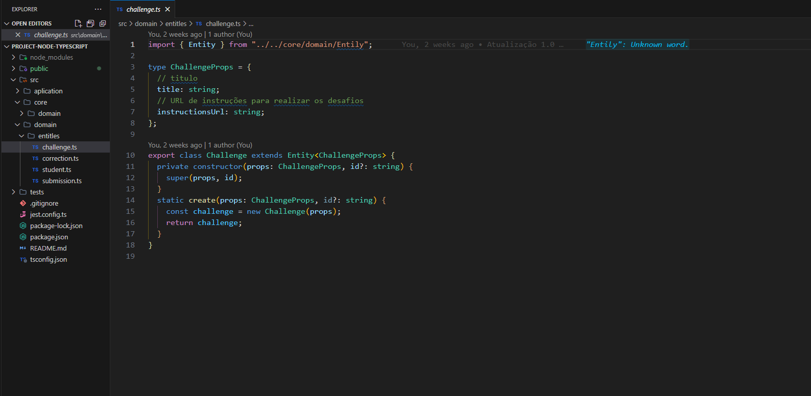
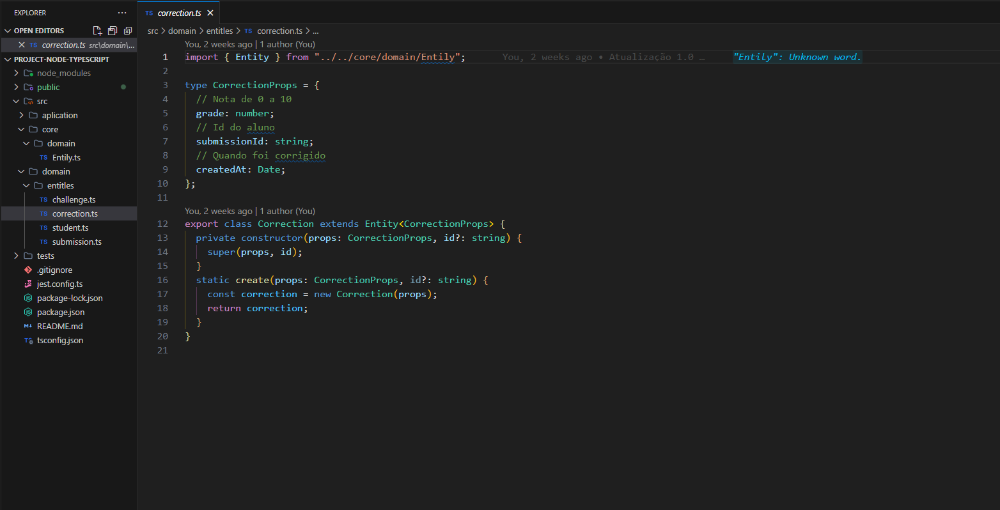
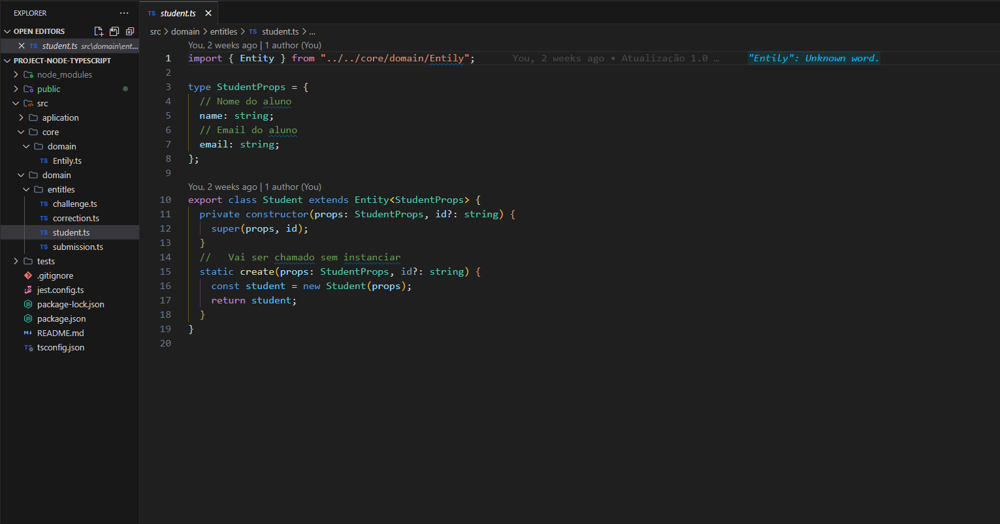
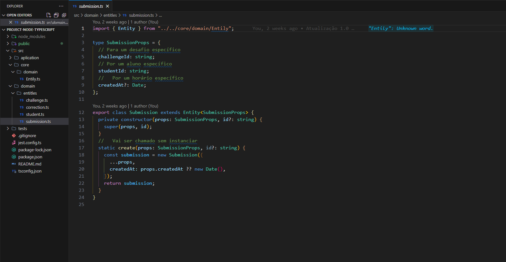
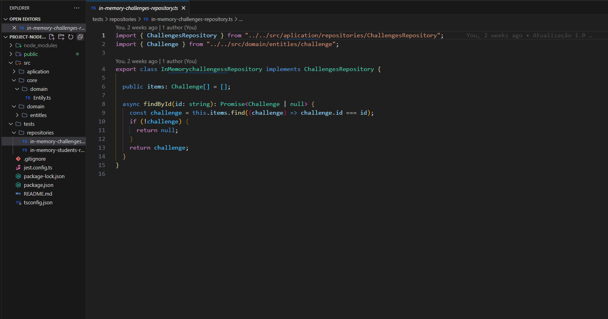
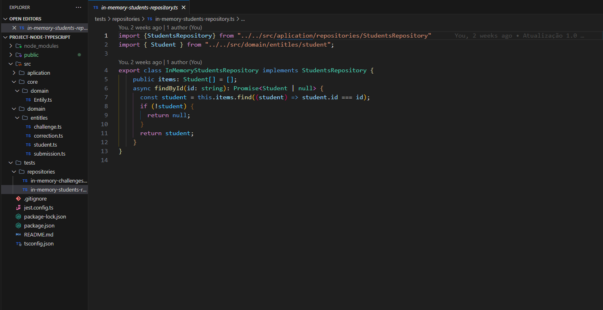

# Construindo APIs Node.js escaláveis com SOLID + TDD

## Descrição do Projeto:

### A proposta do projeto foi deixar um estutrura(base) pronta para o desenvolvimento, resolvendo grandes partes de uma aplicação real, utilizando conceitos SOLID + TDD.

## Código do Projeto;
### ChallengesRepository.ts

### StudentsRepository.ts

### Entily.ts

### challenge.ts

### correction.ts

### student.ts

### submission.ts

### in-memory-challenges-repository.ts

### in-memory-students-repository.ts

## Tecnologias que utilizei para o projeto ;  

 
    
    
    

 

## Creditos:
### Este projeto foi desenvolvido em aula com o professor Diego Fernandes, Rocketseat.

